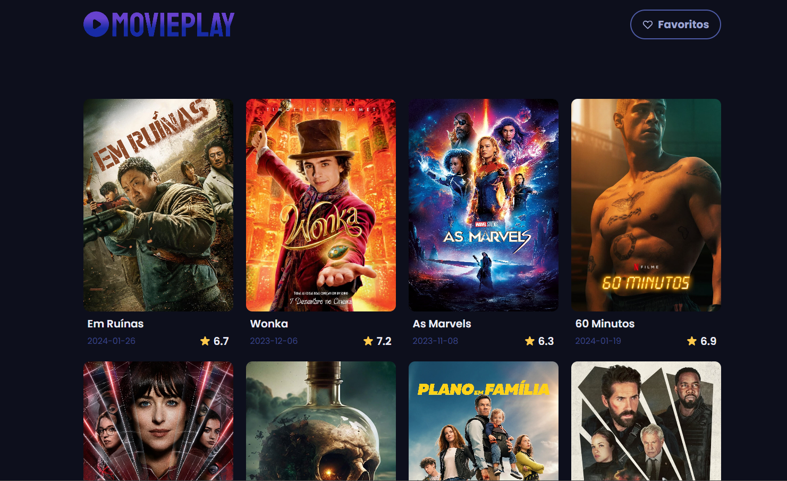

# Explore o melhor do mundo dos cinemas

### 💡Sobre o projeto
Esse projeto foi desenvolvido para aplicar os conhecimentos adquiridos em React.js e Tailwind CSS. Tem como propósito funcionar como um catálogo de filmes populares, incorporando conceitos como react-router-dom para a navegação entre páginas, uso de HTML semântico, criação de variáveis e implementação de responsividade com Tailwind, além do consumo de APIs.

### 💻Tecnologias usadas

### 😊Autor
**Arthur** - _Codificação e criação do designer da aplicação_

### 🚀Demo

<a href="https://movieplay-gold.vercel.app/"/>Link do Projeto</a>

<a href="https://www.figma.com/file/3e69UeiCJ84GmW9tu0WoqP/moviePlay?type=design&node-id=0%3A1&mode=design&t=4QfimPiqiefCCdJv-1"/>Link do Figma</a>
